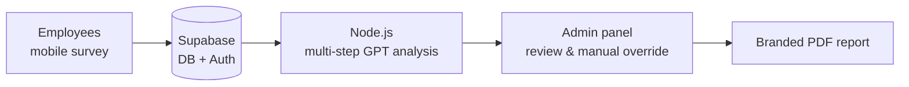
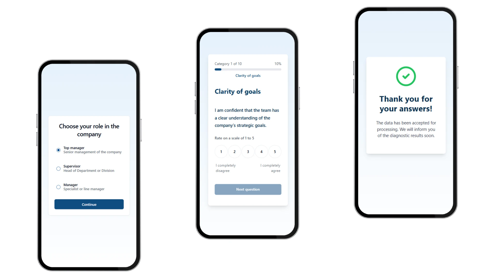
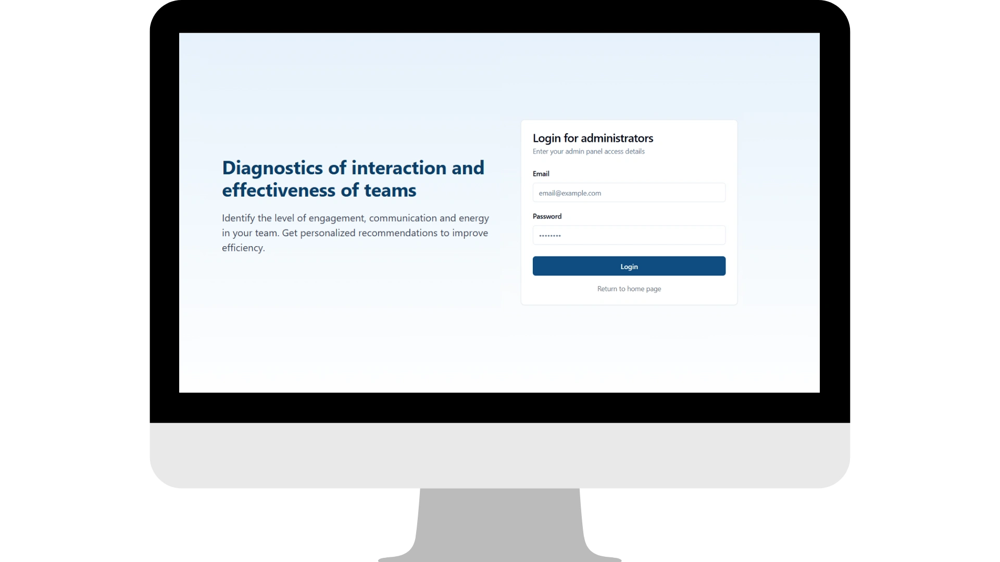
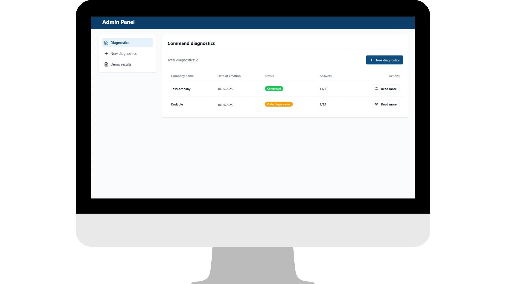
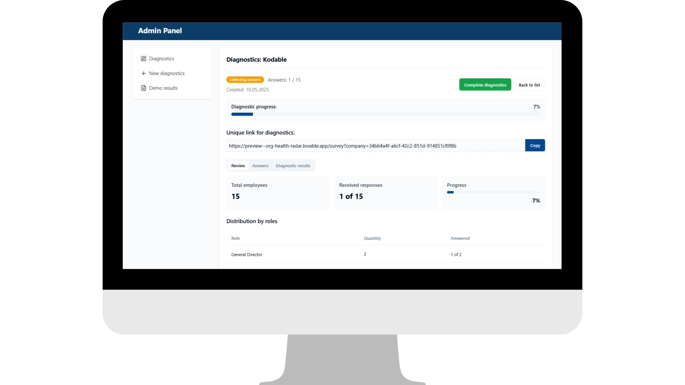
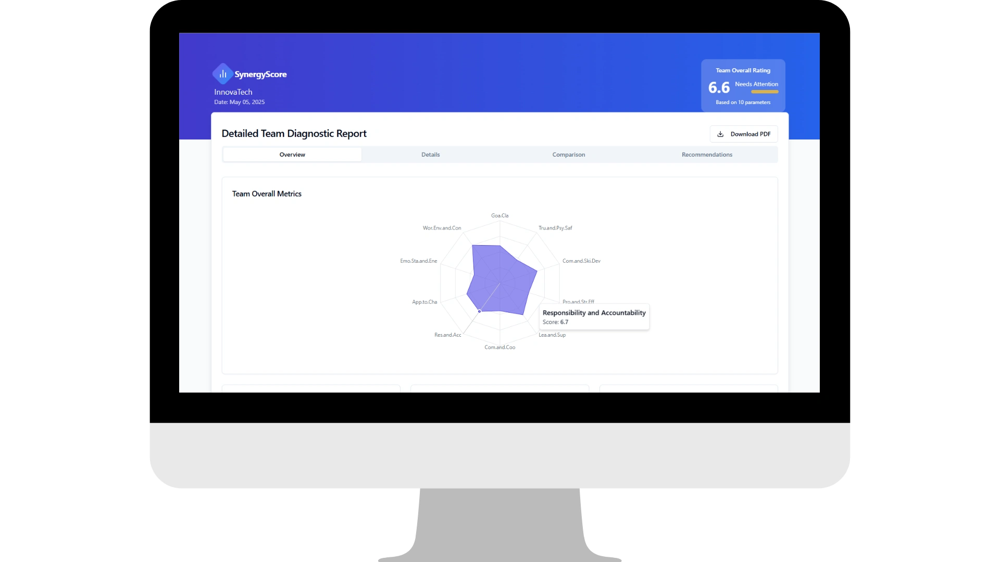
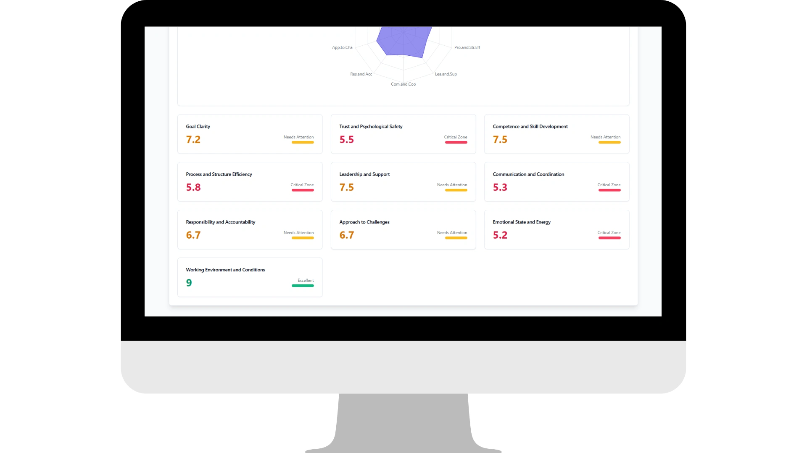
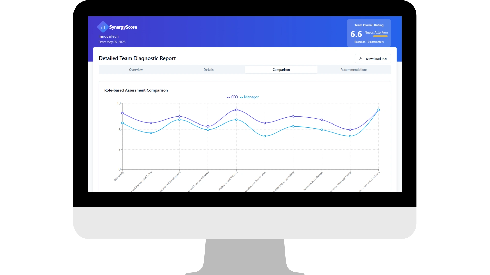
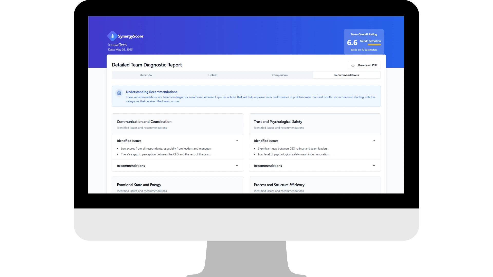

# Automating Team Diagnostics for Growthnomica

> Full-stack MVP that turns a manual, expert-driven team assessment into an AI-powered pipeline: survey → multi-step GPT analysis → admin review → branded PDF report.

| | |
|---|---|
| **Client** | Growthnomica |
| **Role** | Full-stack developer |
| **Timeline** | 15 days (MVP) |
| **Published** | May 2025 |
| **Stack** | Lovable, Supabase, React, TypeScript, Node.js, OpenAI API |

## Results

- **10–15 hours → under 1 hour** of report processing per team
- **MVP delivered in 15 days**
- Diagnostics scale to dozens of teams, with optional manual QA
- Branded output ready for clients or internal use

## Problem

Growthnomica evaluates team well-being across 10 key parameters. The process was fully manual: collecting data, analysing free-text answers, and assembling a report took **10–15 hours per team**.

They needed an end-to-end solution that could:

- collect and process diagnostic data;
- run multi-step AI analysis with GPT;
- give the team an intuitive admin panel;
- auto-generate branded PDF reports;
- scale without sacrificing quality.

## Solution

### Key features

- **Supabase Auth & Database** — secure logins and scalable data storage
- **OpenAI integration** — multi-step GPT analysis across 10 dimensions
- **Custom admin panel** — React + TypeScript, for managing and reviewing diagnostics
- **Auto-generated PDFs** — clean, branded report for each diagnostic
- **Manual override mode** — adjust AI outputs before final export

### Tech stack

| Layer | Technology |
|---|---|
| Frontend | React, TypeScript |
| Backend | Node.js |
| Database & Auth | Supabase (auth, DB, storage) |
| AI | OpenAI API (multi-step GPT workflows) |
| PDF generation | Server-side export with branding support |

## Screenshots

### Employee survey (mobile)

Role selection → 10 categories rated on a 1–5 scale → confirmation.

### Admin panel

| Login | Diagnostics list |
|---|---|
|  |  |

Per-company view: response progress, unique survey link, distribution by roles.

### Automated report

| Overview | Scores by parameter |
|---|---|
|  |  |

| Role-based comparison | AI recommendations |
|---|---|
|  |  |
