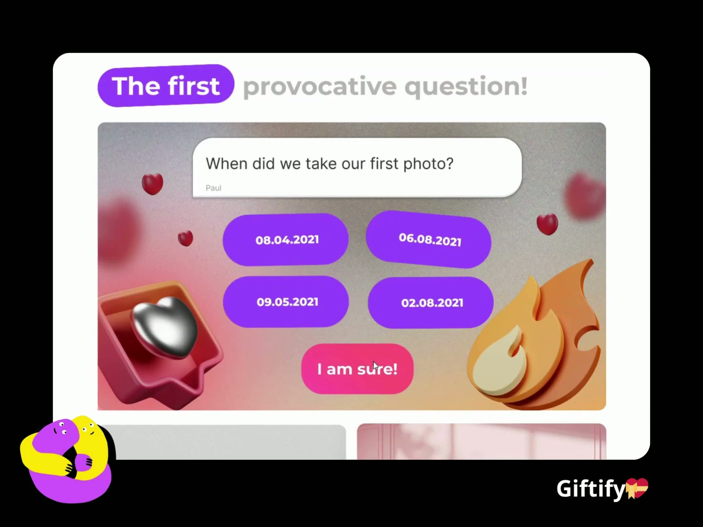
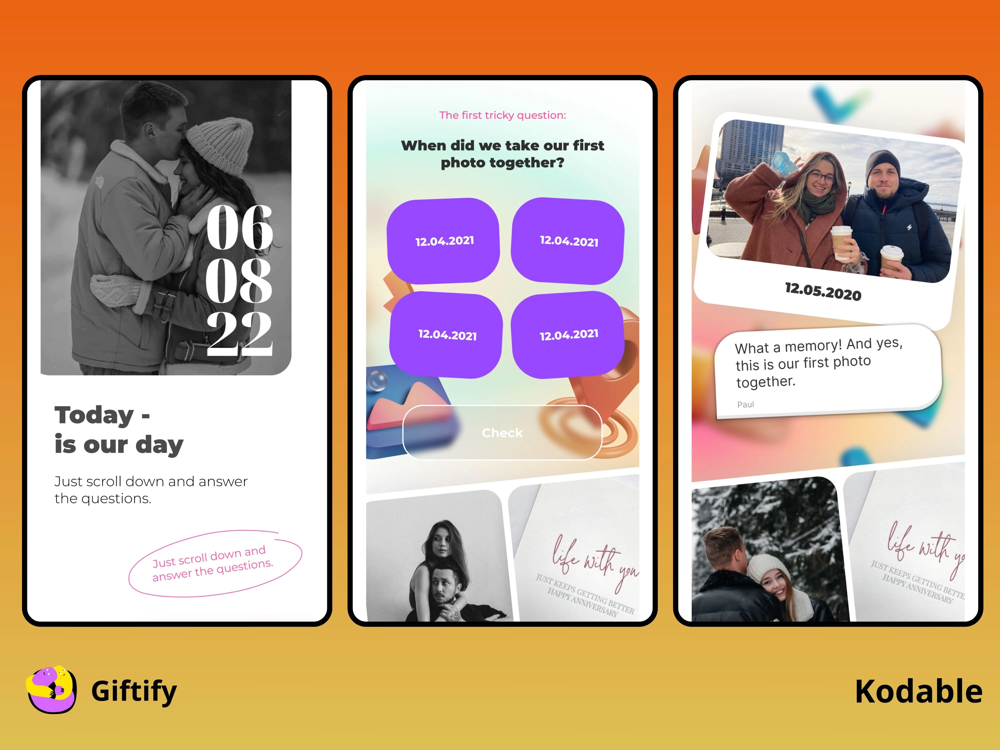
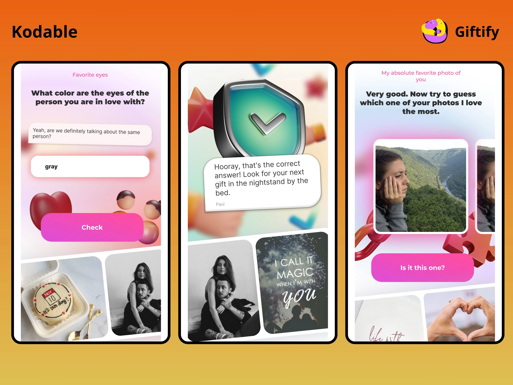
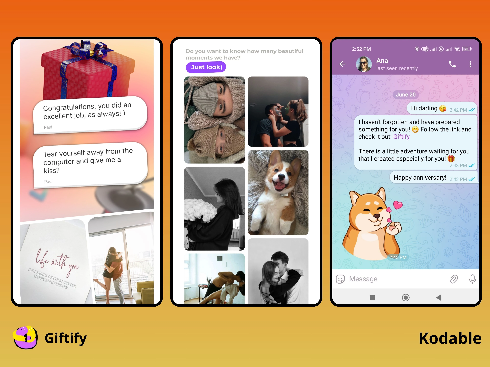

# Giftify — Quizzes and Quests for Building Relationships

> Web platform for creating personalized, gamified greetings and emotional quests for loved ones — combining playfulness with emotional depth.

| | |
|---|---|
| **Product** | Giftify ([@giftify_quest](https://www.instagram.com/giftify_quest)) |
| **Role** | Co-Founder — Product & Project Manager |
| **Timeline** | Aug 2023 – Nov 2024 |
| **Team** | 6 developers and designers |
| **Stack** | React, TypeScript, Node.js, MongoDB |

## Demo

▶ [Watch the quest walkthrough (1 min)](assets/quest-demo.mp4)

## Problem

Giftify set out to test market fit for emotionally intelligent gifting formats and explore scalable digital offerings in the greeting / relationship space. It needed a platform that strengthens relationships and emotional intelligence through interactive quizzes and quests, while serving as a testbed for customer-acquisition ideas.

## Solution

A unique brand identity and a user-friendly platform with:

- **Drag-and-drop quest builder** for gamified quizzes
- **AI-powered recommendations** for personalized experiences
- **Gamification elements** to boost motivation
- **React.js** front end for a clean, intuitive interface
- **Node.js + MongoDB** back end for scalable performance

### Tech stack

| Layer | Technology |
|---|---|
| Frontend | React, TypeScript |
| Backend | Node.js |
| Database | MongoDB |

## My contribution

### Product strategy & validation

- Conducted extensive market and competitor research
- Designed and validated the product concept through customer interviews
- Tested multiple monetization and acquisition hypotheses
- Built and analyzed unit economics to guide MVP scope and pricing

### MVP delivery & team management

- Recruited and managed a cross-functional team of 6 developers and designers
- Defined core features and created a clear MVP roadmap
- Oversaw day-to-day development with milestone tracking and agile planning
- Led multiple rounds of user testing to iterate on UX and functionality

### Launch

- Released the first working version and completed several client orders
- Collected direct feedback from real users to guide product iterations
- Participated in a startup project tracking program to benchmark traction and team dynamics

## Outcome

The platform showed early promise and generated interest, but active development was paused after facing challenges with repeat sales and identifying scalable adjacent products.

The project delivered valuable insights into emotional-product market dynamics, digital gifting behavior, and product-led growth strategies.

## Screenshots

### Quest intro and quiz questions

### Free-text and photo questions with feedback

### Personal messages, photo gallery and sharing

