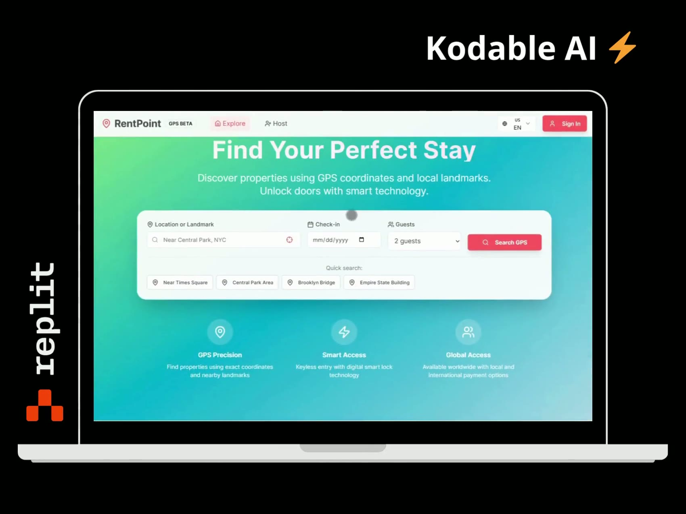
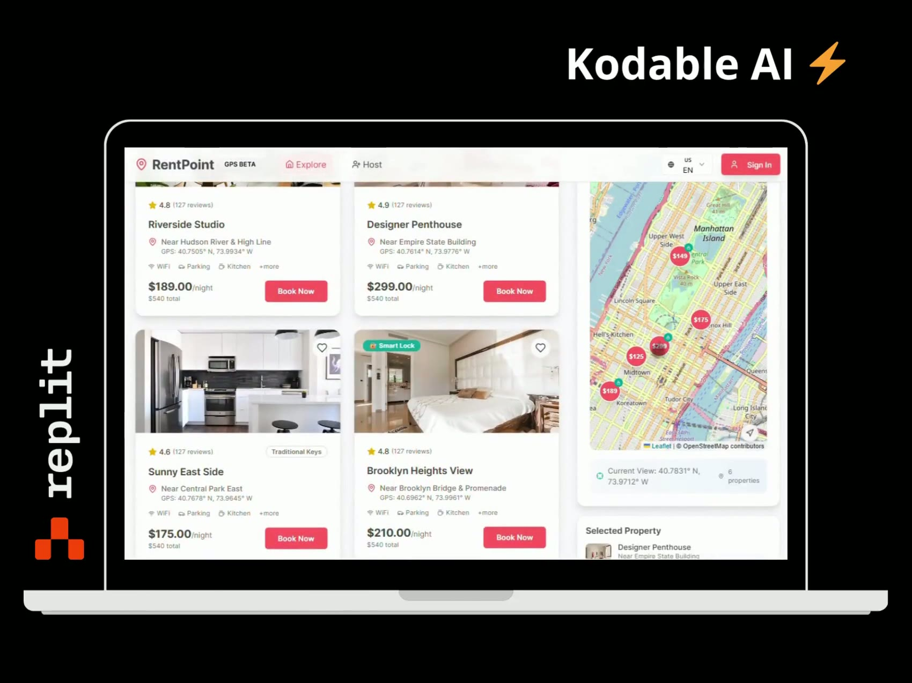

# RentPoint — Airbnb-like Platform Prototype

> Rapid prototype of a short-term rental platform focused on precise property discovery and keyless guest access.

| | |
|---|---|
| **Type** | Rapid prototype |
| **Role** | Full-stack developer |
| **Published** | July 2025 |
| **Stack** | React, Tailwind CSS, Mapbox GL JS, Node.js, Express, Replit |

## Demo

▶ [Watch the prototype walkthrough (30 sec)](assets/rentpoint-demo.mp4)

## Goal

Build a working prototype of an Airbnb-like platform that improves property discovery and streamlines the guest experience — fast enough to validate the core UX and the smart-access concept before investing in a full MVP.

## Solution

### Core features

- **Location-based search** — guests discover properties by precise GPS coordinates and nearby landmarks
- **Smart access** — smart lock integration lets guests unlock the door directly from the app
- **User-friendly interface** — clean, responsive UI optimized for mobile and desktop

### Tech stack

| Layer | Technology |
|---|---|
| Frontend | React, Tailwind CSS, Mapbox GL JS |
| Backend | Node.js, Express |
| Environment | Replit — built and deployed for fast iteration and testing |

## Outcome

- Enabled quick validation of the core user experience and smart-access functionality
- Positioned for further development into a full MVP

## Screenshots

### Search by location or landmark

### Listings with GPS property map

