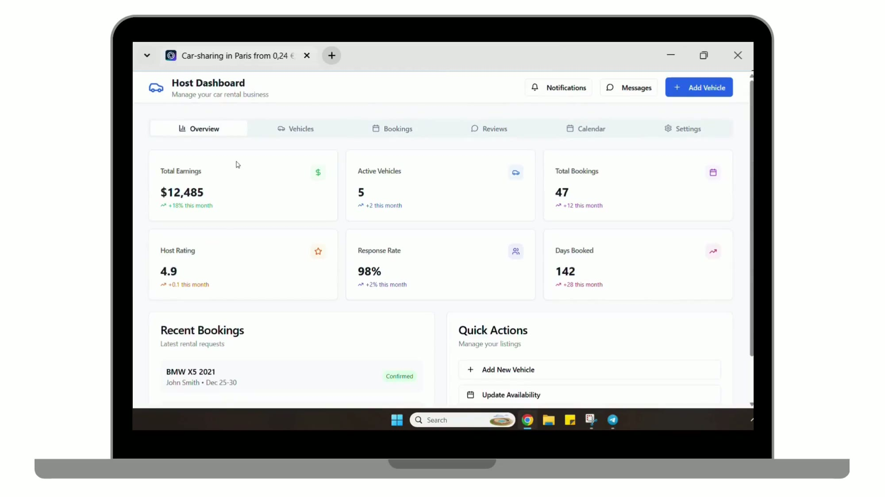
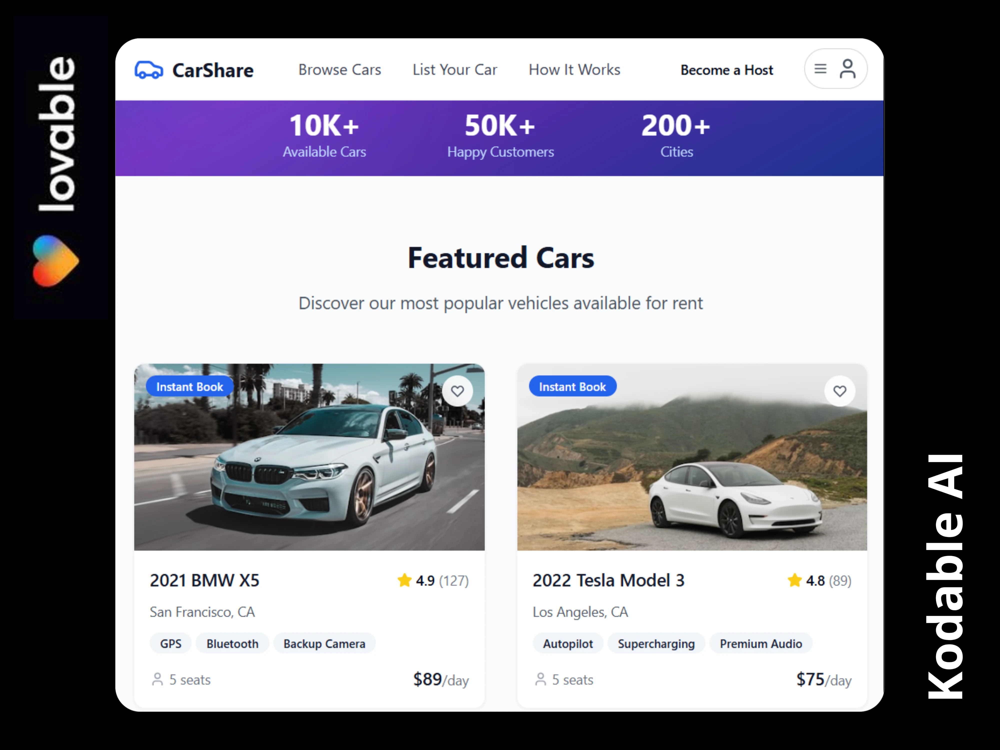
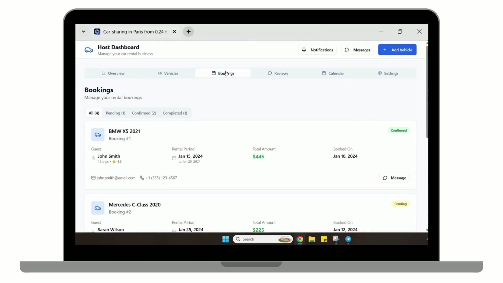

# CarShare — From Idea to AI Prototype in Hours

> Peer-to-peer car rental platform ("Airbnb for cars") prototyped with AI tools before estimation, so the client could react to real screens and flows instead of a spec.

| | |
|---|---|
| **Type** | Pre-sale AI prototype |
| **Published** | June 2025 |
| **Build time** | A few hours (client saw it live in under a day) |
| **Stack** | Lovable, Next.js, React |

## Demo

▶ [Watch the prototype walkthrough (36 sec)](assets/carshare-demo.mp4)

## The request

A client asked for an estimate: *"Build a peer-to-peer car rental platform like Airbnb for cars."*

Users should be able to:

- list their vehicles;
- manage availability via a calendar;
- handle bookings easily.

## Approach

Before estimating, we built an AI-powered prototype in just a few hours:

- to make sure we fully understood the product;
- to give the client something to react to — real screens and flows, not just specs;
- to clarify the scope and reduce surprises later.

### What the prototype covers

- **Guest side** — landing page, featured cars with ratings, features and daily price, instant-book badges
- **Host dashboard** — earnings, active vehicles, bookings, rating and response-rate metrics; quick actions
- **Vehicles** — host's fleet with status, pricing and per-vehicle calendar
- **Bookings** — filter by pending / confirmed / completed, guest details, accept / decline
- **Reviews** — rating summary and guest feedback with replies
- **Add vehicle** — listing form with photo upload

## Result

- The client saw their idea live in less than a day
- Scope aligned quickly and the project was estimated accurately
- The client chose us for professionalism, speed and clarity

## Screenshots

### Featured cars

### Host dashboard and bookings

| Overview | Bookings |
|---|---|
|  |  |
