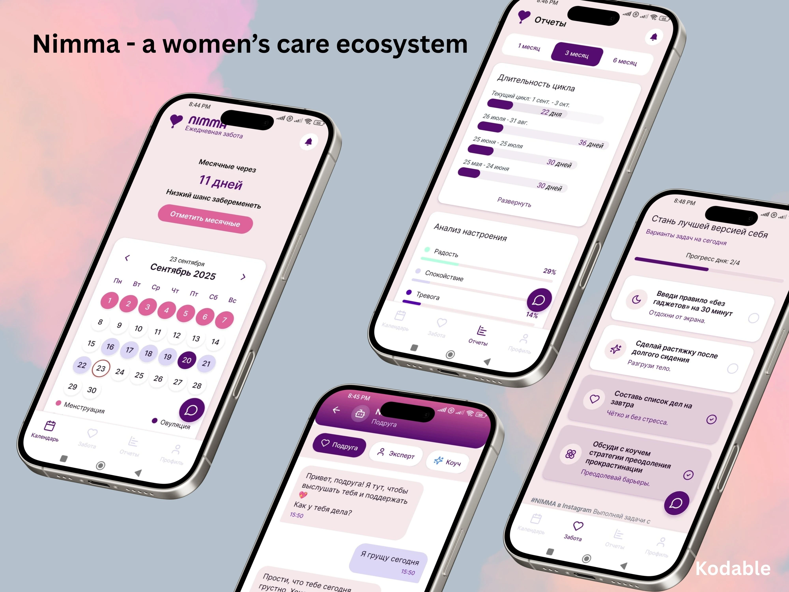
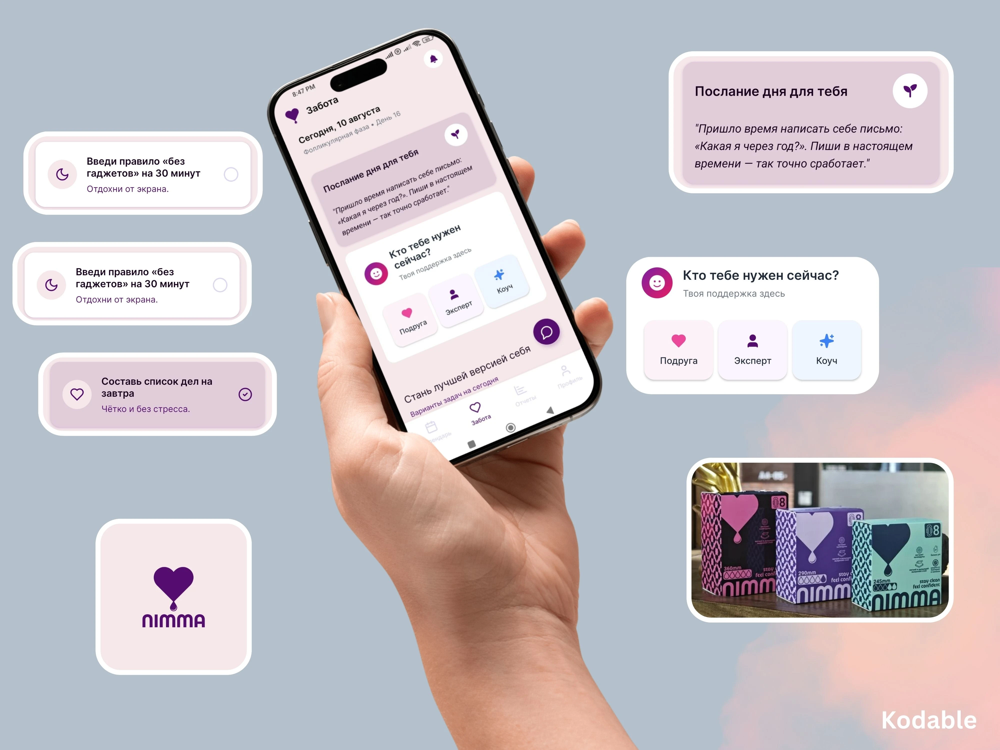

# Nimma — Women's Care Mobile App MVP

> Mobile app for a women's care ecosystem: high-quality pads, a cycle tracker, and a monthly subscription with delivery — everything to help every woman feel confident and comfortable every day.

| | |
|---|---|
| **Client** | Nimma |
| **Role** | Mobile app developer |
| **Timeline** | 2 months (MVP) |
| **Published** | September 2025 |
| **Stack** | React Native, TypeScript, Node.js, Replit |

## Results

- Functional, user-friendly MVP delivered on schedule in **2 months**
- Design and development time reduced by using AI in the prototyping stage
- Client able to test with real users, gather insights and plan the next phase with confidence

## Challenge

Build a mobile app that combines functionality, ease of use and an appealing design — within a tight timeframe. The client needed a working solution quickly to validate the concept and test it with real users.

## Solution

1. **AI-powered prototyping** — AI tools generated an interactive prototype early on, so we could visualize the product quickly, test different flows and get instant feedback.
2. **UI/UX approval** — together with the client we refined the interface and finalized the core feature set, matching both user expectations and business goals.
3. **MVP development** — the team built the MVP in 2 months: the essential features for launch, with scalability for future iterations.

### App features

- **Cycle calendar** — period prediction, menstruation and ovulation days
- **Reports** — cycle length history and mood analysis over 1 / 3 / 6 months
- **Daily care** — message of the day and daily self-care tasks with progress
- **Support chat** — "Who do you need right now?" with Friend / Expert / Coach modes

### Tech stack

| Layer | Technology |
|---|---|
| Mobile | React Native, TypeScript |
| Backend | Node.js |
| Prototyping | AI tools, Replit |

## Screenshots

> The app UI is in Russian.

