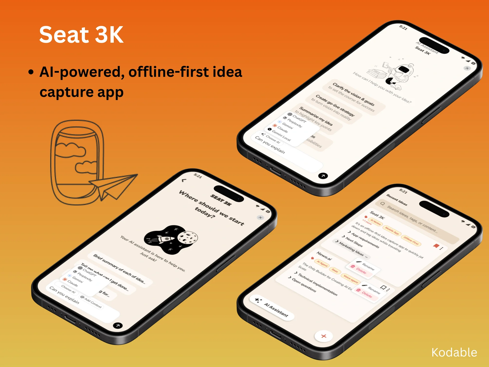
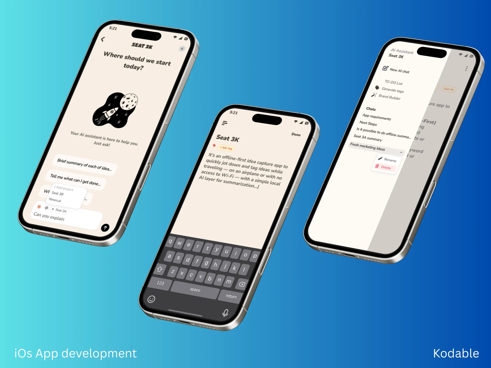
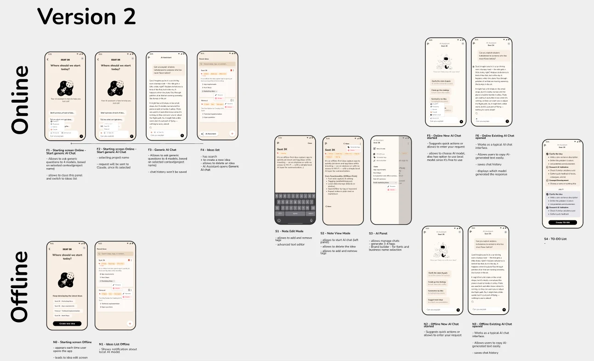

# Seat 3K — AI-Powered, Offline-First Idea Capture App

> Native iOS app for capturing and developing ideas at 35,000 feet: notes, tags and AI summarization work fully offline with an on-device model, and sync back when the connection returns.

| | |
|---|---|
| **Platform** | iOS (native) |
| **Role** | iOS developer / mobile designer |
| **Stack** | Swift, SQLite, Gemma 3n (on-device), Google Gemini |

## Problem

Imagine being 35,000 feet above the ground, with ideas flowing faster than your Wi-Fi connection — and no way to work on them with AI. That was the client's problem.

They didn't just want an app — they wanted certainty, control and trust in the development process.

## Solution

We designed and built an iOS app from scratch, using **Gemma 3n**, a lightweight AI model, to summarize ideas on-device. Every step was transparent: user flows, prototypes and progress updates were shared with the client throughout.

### Features

- **Offline note capture** — quickly jot down notes without Internet access
- **Tags, search and filters** — find any idea in seconds
- **Local AI summarization** — summarize thoughts instantly with an on-device model
- **Export** — plain text or Markdown
- **Online sync** — synchronization once the connection is back

### Online and offline modes

The app switches its AI layer depending on connectivity:

| | Online | Offline |
|---|---|---|
| **AI models** | Choice of ChatGPT, Perplexity, Gemini, Claude or local model | Local on-device model |
| **AI assistant** | Quick actions, project context via `@`, chat history, shows which model answered | Quick actions, chat history, copy AI output |
| **Ideas** | List with search, tags, rename / delete | Same, with a notice about the local AI model |

AI panel tools: generate 3–4 tags, build a TO-DO list from an idea, brand builder (fonts and business name selection).

### Tech stack

| Layer | Technology |
|---|---|
| App | Swift (iOS) |
| Local storage | SQLite |
| On-device AI | Gemma 3n |
| Cloud AI | Google Gemini and other LLM providers (online mode) |

## Outcome

- Offline-first idea capture app delivered from scratch
- Edge cases handled quickly without compromising quality
- Client kept full visibility through regular updates and demos, with the roadmap always visible
- Client ended the project confident and ready to launch

## Screenshots

### AI assistant and ideas list

### AI chat, note editor and AI panel

### User flows (version 2)

Online flows (F1–F6), note and AI panel screens (S1–S4), offline flows (N0–N3).

