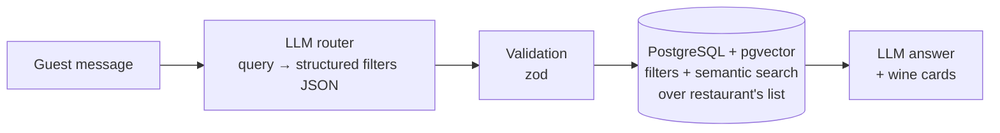
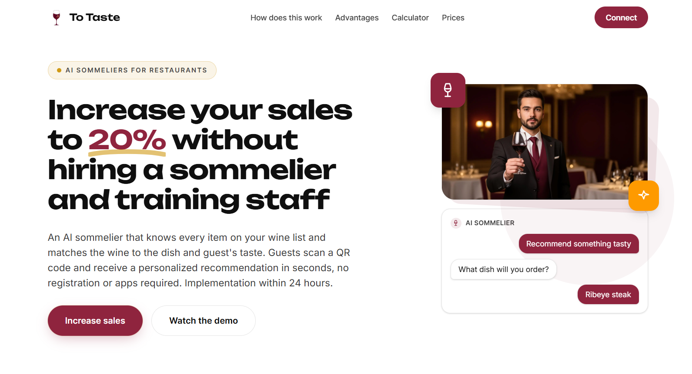
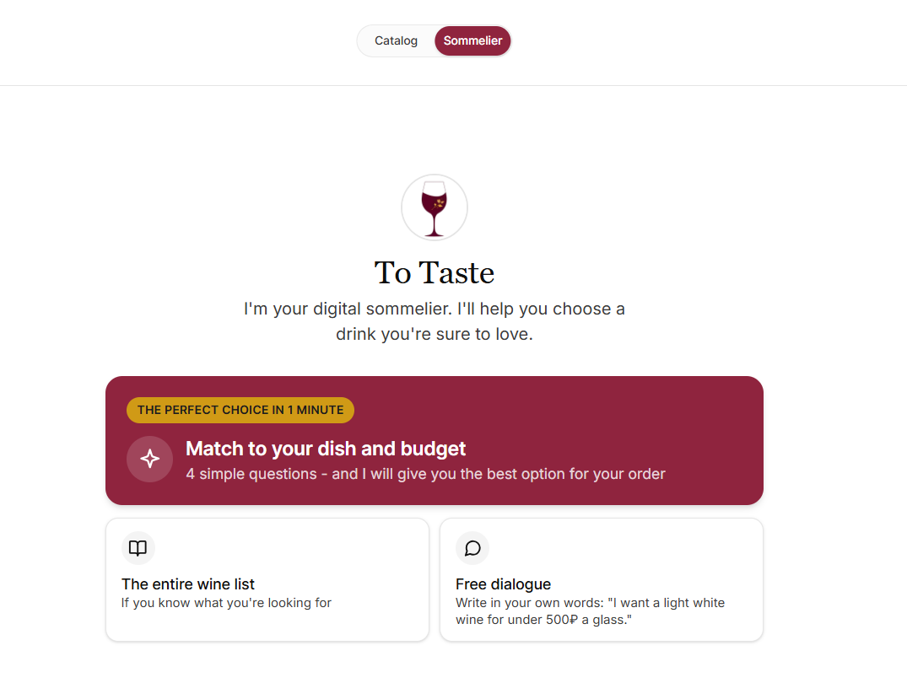
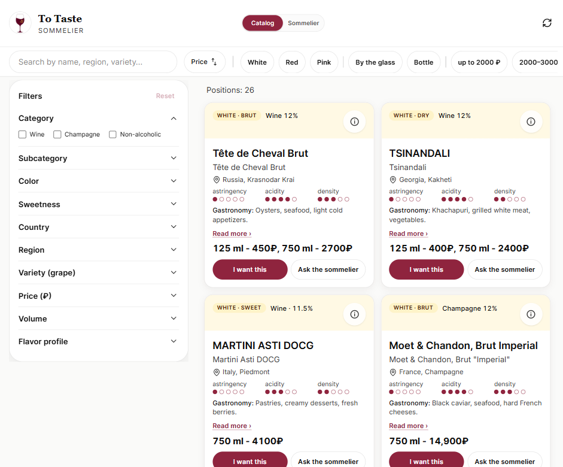
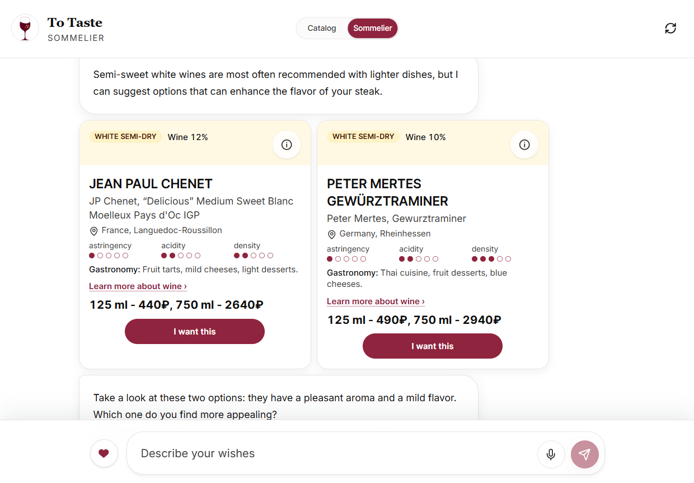
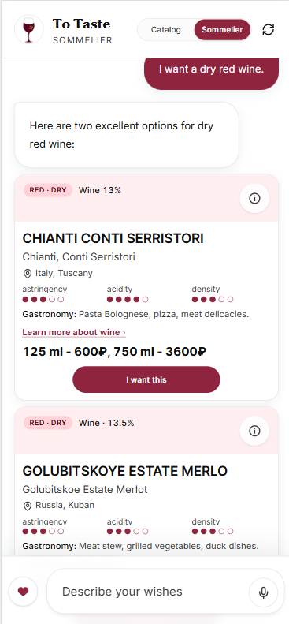
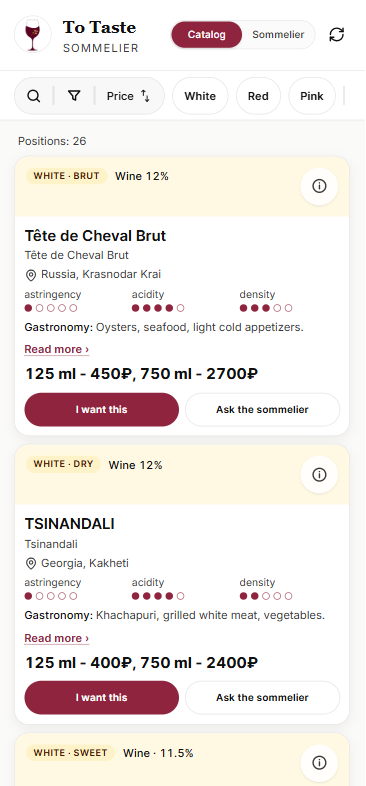

# To Taste — AI Sommelier & Digital Wine List for Restaurants

> Built from scratch: a digital wine list with an AI sommelier. Guests scan a QR code at the table and get a personalized wine recommendation for their dish, taste and budget in seconds — no registration or app install.

| | |
|---|---|
| **Product** | [pvkusu.ru](https://pvkusu.ru) |
| **Role** | Developer |
| **Published** | July 2026 |
| **Stack** | Next.js, React, TypeScript, PostgreSQL + pgvector, OpenAI / YandexGPT / GigaChat |

## Challenge

- **Choice paralysis.** Wine lists overwhelm non-expert guests, and sommelier terminology doesn't help them decide.
- **Domain-aware AI.** The assistant has to understand wine terms, tasting notes and food pairings, and recommend only what is actually on *this* restaurant's list, at its prices.
- **Ground-up platform.** Multi-restaurant web app where each venue manages its own wine list and gets its own guest-facing page.

## Solution

### Guest experience

- **QR → sommelier page** per restaurant (`/{slug}`), mobile-first, no sign-up
- **Guided wizard** — "match to your dish and budget" in 4 questions
- **Free dialogue** — natural-language requests, e.g. *"a light white wine under 500₽ a glass"*, with voice input
- **Recommendation cards in chat** — style, region, astringency / acidity / body scales, food pairings, prices per glass and bottle, "I want this" action
- **Full catalog** — search and filters by category, colour, sweetness, country, region, grape, price, volume, flavour profile

### AI recommendation pipeline

- An LLM router turns free text into structured search filters (colour, sugar, grape, price / volume ranges, tannins, acidity, etc.); the output is validated before it reaches the database
- Retrieval combines those filters with **pgvector** semantic search over wine descriptions — so recommendations are grounded in the restaurant's real list
- Separate food-pairing check endpoint
- **Vendor-agnostic AI layer** — switchable between OpenAI, YandexGPT and GigaChat (chat and embeddings), with per-request usage logging

### Restaurant admin

- Restaurants, users and profile management
- **Excel wine-list upload** — on import the system generates embeddings and replaces the restaurant's list
- Guest interest tracking ("I want this") and analytics sync

### Engineering

- SQL migrations (node-pg-migrate) with pgvector search functions
- Unit tests (Vitest), error monitoring (Sentry)
- CI/CD with GitHub Actions: `dev` and `main` branches auto-deploy to separate environments on a VPS (PM2 + nginx), each with its own PostgreSQL database

### Tech stack

| Layer | Technology |
|---|---|
| Frontend | Next.js (App Router), React, TypeScript, Tailwind CSS |
| Backend | Next.js API routes, Node.js, zod |
| Database | PostgreSQL + pgvector |
| AI | OpenAI API, YandexGPT, GigaChat — chat, embeddings, TTS |
| Infrastructure | VPS, PM2, nginx, GitHub Actions, Sentry |

## Results

- Complete end-to-end platform launched from scratch and running in production at [pvkusu.ru](https://pvkusu.ru)
- Restaurant onboarding within 24 hours: upload an Excel wine list, print the QR code

## Screenshots

### Landing page

### Sommelier home and catalog

| Sommelier home | Catalog with filters |
|---|---|
|  |  |

### AI chat recommendations

### Mobile

| Chat | Catalog |
|---|---|
|  |  |
