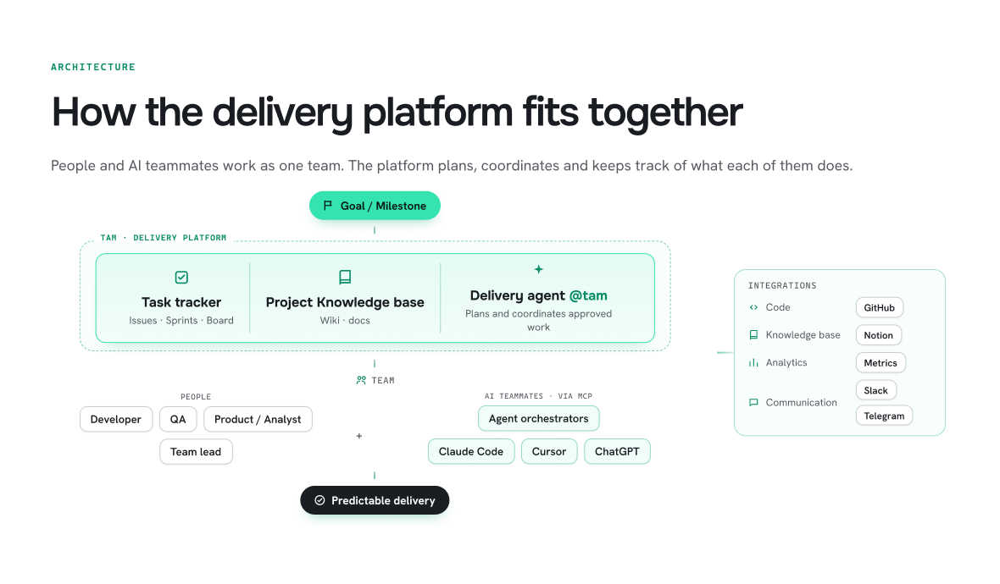
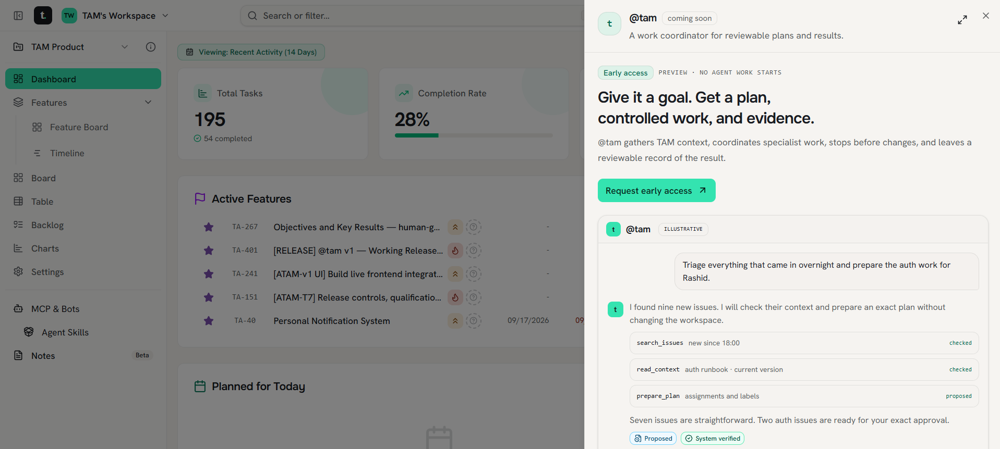
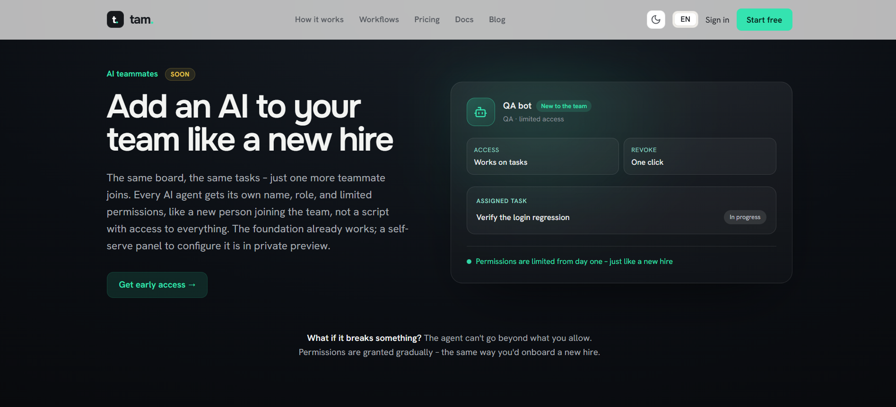
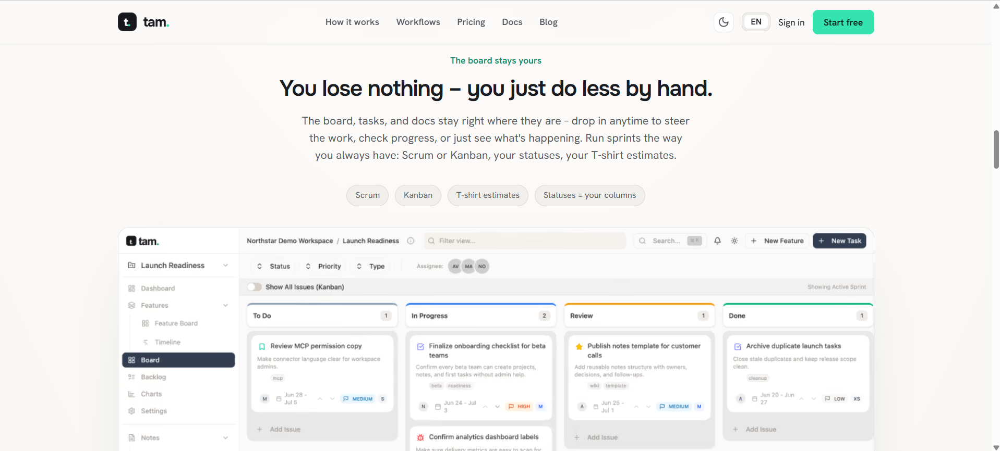
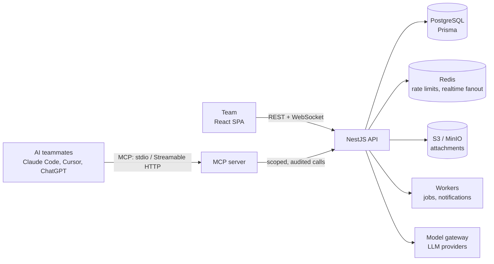

# tam — AI-Native Software Delivery Platform

> **AI can produce more code than people can coordinate.** tam is a delivery platform for AI-first engineering teams: it unifies task management, project knowledge and AI coding agents into a single, governed delivery loop — run by a dedicated delivery agent.

🔗 **[thetam.app](https://thetam.app/)**

| | |
|---|---|
| **Product** | [tam](https://thetam.app/) — AI-native software delivery platform |
| **For** | CTOs and Tech Leads of AI-active engineering teams |
| **Role** | Full-stack developer (core team) |
| **Timeline** | 2026 — ongoing |
| **Stack** | React, NestJS, PostgreSQL / Prisma, Redis, Socket.IO, MCP, Next.js, Kubernetes |

## The problem

AI generates code instantly — but feature delivery hasn't kept pace.

Instead of shipping high-impact work, senior engineers spend their days on supporting activities: **supervising agents, updating tickets and managing handoffs** between people and AI. The bottleneck has moved from writing code to coordinating it.

## The solution

**tam is a delivery platform powered by a dedicated delivery agent.** The agent breaks goals down into a single, minimal-delay delivery loop for humans and AI agents — handling task handoffs, approvals and automated quality checks, so the team moves from goal to milestone without the "work about work".

People and AI teammates work as one team. The platform plans, coordinates and keeps track of what each of them does.

### Platform components

| Component | What it does |
|---|---|
| **Task tracker** | Issues, sprints and visual boards — Scrum or Kanban, your statuses, your T-shirt estimates |
| **Project knowledge base** | Wiki and docs that hold team context and guidelines — for people and agents alike |
| **Delivery agent `@tam`** | The orchestration engine: plans, coordinates and syncs approved work across human roles (Dev, QA, PM) and AI teammates |
| **AI teammates via MCP** | Claude Code, Cursor, ChatGPT and agent orchestrators join the loop through the Model Context Protocol |

### Key use cases

- **Automated workflow coordination** — no more ticket-updating overhead or manual handoffs between humans and AI agents
- **AI teammate orchestration** — bring AI coding assistants into the core loop as full-fledged team members, with dedicated permissions, audit logs and secure access
- **Faster release cycles** — automated evidence compilation (**Evidence Bundles**) and **1-click execution approvals**

### Give it a goal. Get a plan, controlled work, and evidence.

`@tam` gathers project context, coordinates specialist work, **stops before changes** and leaves a reviewable record of the result.

## Governed by design

AI in the delivery loop is only useful if it's safe. tam is built around control:

- **Permissions like a new hire** — every AI teammate gets its own name, role and narrow scope; access is granted gradually and revoked in one click
- **Plan before action** — the agent proposes, a human approves the exact change
- **Evidence, not promises** — every agent step leaves an auditable record
- **Fail-closed security** — unknown tools, scopes or revoked credentials are rejected by default

### The board stays yours

You lose nothing — you just do less by hand. The board, tasks and docs stay where they are: drop in anytime to steer the work, check progress, or just see what's happening.

## Status

- **Available now:** task tracker, knowledge base, MCP integration with AI coding assistants, personal dashboard, real-time collaboration, Global (EN) and CIS (RU) editions with self-service billing
- **Closed beta:** the `@tam` delivery agent and AI teammates — onboarding **5 design-partner teams**, targeting a **30% shorter time-to-milestone** without sacrificing code quality
- **Planned integrations:** GitHub, Notion, Slack, Telegram, analytics

## Under the hood

A production-grade, multi-tenant platform engineered for both human teams and AI clients.

- **MCP server** — local stdio and Streamable HTTP; a single generated registry of **160+ typed tools** drives backend route policy, MCP validation, consent UI and docs
- **OAuth for AI clients** — PKCE (S256), tokens bound to workspace, project and tools; rotation, reuse detection and revocation
- **Horizontally scalable backend** — multiple API pods, background workers, DB-backed job locks, Redis-backed realtime fanout
- **Regional model gateway** — stateless service for LLM provider calls, separated from product logic
- **Quality gates** — hundreds of unit and real-dependency E2E tests across backend, frontend and MCP, browser regression journeys, CI on every change
- **Operations** — Docker, Kubernetes, Prometheus metrics, Sentry, documented rollback policy

### Tech stack

| Layer | Technology |
|---|---|
| Web app | React, Vite, TypeScript, Tailwind CSS, Radix UI, TanStack Query, Zustand, Socket.IO client |
| Backend | NestJS, Prisma, PostgreSQL, Redis, pg-boss, Socket.IO, Stripe |
| AI integration | Model Context Protocol (MCP) server, OAuth 2.1 / PKCE, model gateway |
| Public site | Next.js, next-intl |
| Infrastructure | Docker, Kubernetes (k3s), S3 / MinIO, Prometheus, Sentry, GitHub Actions |
| Testing | Jest, Playwright, full-stack E2E |

## My contribution

Full-stack work across the web app, backend, MCP server and public site:

- **Personal dashboard ("My work")** — read contract, UI, optional modules, attention ranking, access-aware `@tam` threads
- **Notifications** — personal notification system
- **Issues** — comments with image and file attachments, subtasks, custom fields, history, search by issue key, watch / follow
- **Project labels** — label registry replacing free-text tags
- **MCP server** — real error codes and field coverage for AI clients
- **Onboarding tour, skills and billing UI** overhaul
- **Public site** — landing updates, SEO / GEO, blog launch with 25+ articles on AI agent governance, MCP docs reference, partners and closed-beta design-partner pages

---

**Leading an AI-active engineering team?** Join the closed beta → [thetam.app](https://thetam.app/)
